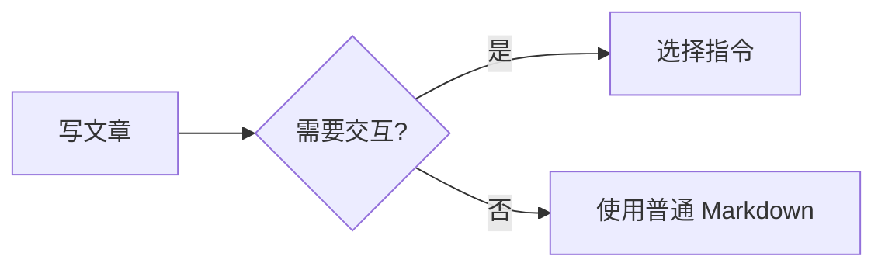
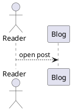

# 代码块与图表

## 普通代码块

使用 fenced code block，并写真实语言名；语言名会影响语法高亮、语言徽章和复制体验：

````markdown
```ts title="src/main.ts"
export const answer = 42;
```
````

代码块元信息可以同时包含 `title="路径"`、行标记和 `collapse`：

````markdown
```ts title="src/main.ts" del={2} ins={3} {5} collapse
const oldValue = 1;
const nextValue = 2;
console.log(nextValue);
```
````

- `title` 显示文件名，也会被 `:::code-tree` 用来建立目录。
- `del={2}`、`ins={3-4}`、`{5-7}` 标记删除、新增或重点行；多个范围可用空格分隔。
- `collapse` 强制该代码块默认折叠。普通长代码块在超过 `10` 行时会出现折叠能力，默认仍展开，预览 `5` 行。
- 行尾注释还支持 `// [!code ++]`、`// [!code --]`、`// [!code focus]`、`// [!code error]`、`// [!code warning]`；具体注释前缀应符合目标语言。

不要为了触发折叠而截断代码，也不要把配置项写成正文中无法运行的伪代码。源码中的 `lineThreshold`、`previewLines` 和 `defaultCollapsed` 属于主题配置，不是文章级属性。

## 语言别名

以下别名会在构建前转换为可高亮的语言；图表别名还会附带对应渲染标记：

| 文章中写的语言 | 实际语言/行为 | 用途 |
| --- | --- | --- |
| `astro.config.mjs`、`astro.config.js` | `js`，自动显示文件标题 | Astro 配置片段 |
| `cname` | `txt`，标题 `CNAME` | CNAME 文件 |
| `deploy.yml`、`deploy.yaml` | `yaml`，自动显示文件标题 | 部署配置 |
| `env` | `bash` | 环境变量文件 |
| `redis`、`vcl` | `txt` | 无专用高亮时保留文本 |
| `wavedrom`、`wave` | `json` + WaveDrom | 时序图 |
| `bytefield`、`bytefield-svg` | `clojure` + Bytefield | 协议字段图 |
| `vega-lite`、`vegalite`、`vl` | `json` + Vega-Lite | 数据可视化 |

优先使用表中的别名或标准语言名，不要自造 `architecture`、`dot`、`infographic`、`canvas` 等未注册的图表语言。

## 图表选择

图表代码块不是 `:::name` 容器，不需要 `import`。根据内容选择一种引擎：

| 语言 | 适合表达 | 渲染阶段与边界 |
| --- | --- | --- |
| `mermaid` | 流程图、时序图、状态图、类图 | 页面端按需加载；开发环境显示占位符，生产环境由浏览器渲染。语言名使用小写。 |
| `plantuml` | UML、组件图、部署图 | 构建时生成 PlantUML 服务 URL，页面端按需加载并支持亮暗主题；需要可访问配置中的 PlantUML 服务。 |
| `markmap` | 从标题/列表生成可缩放思维导图 | 页面端按需加载；开发环境显示占位符，正文使用 Markdown 标题或列表层级。 |
| `vega-lite` | 统计图、编码映射和交互式数据图 | 进入视口后加载引擎；代码块内容必须是有效 JSON 规范。 |
| `wavedrom` | 时钟、总线和握手信号 | 构建期解析 JSON5 并嵌入 SVG；语法错误会让构建阶段产生诊断。 |
| `bytefield` | 网络协议、文件格式和寄存器位布局 | 构建期解析 bytefield-svg 的 EDN/Clojure DSL 并嵌入 SVG；语法错误会让构建阶段产生诊断。 |

### Mermaid



Mermaid 代码应保持图表语法本身可被 Mermaid 解析；不要把 Markdown 标题或 `:::` 容器混入围栏内部。

### PlantUML

````markdown

````

始终写 `@startuml` 和 `@enduml`。它依赖外部服务和网络，敏感数据不要直接放入图中；构建或线上服务不可用时需要接受降级。

### Markmap

````markdown
```markmap
# 文章
## 背景
## 方案
- 方案 A
- 方案 B
```
````

Markmap 只把代码块文本当作思维导图源；复杂富文本、组件指令和自定义脚本不会作为节点内容可靠保留。

### Vega-Lite

```json
{
  "$schema": "https://vega.github.io/schema/vega-lite/v6.json",
  "data": {"values": [{"label": "A", "value": 3}]},
  "mark": "bar",
  "encoding": {
    "x": {"field": "label", "type": "nominal"},
    "y": {"field": "value", "type": "quantitative"}
  }
}
```

也可以把围栏语言写成 `vegalite` 或 `vl`。`data.url` 会在浏览器请求外部数据，需确认 URL、CORS 和许可。

### WaveDrom

````markdown
```wavedrom
{signal: [{name: "clk", wave: "p......"}, {name: "data", wave: "x.345x", data: ["A", "B", "C"]}]}
```
````

WaveDrom 使用 JSON5，因此键名可以不加引号，但字符串和数组仍需符合 JSON5 语法。可用 `wave` 作为别名。

### Bytefield

````markdown
```bytefield
(def column-labels (mapv #(number-as-hex % 2) (range 32)))
(def boxes-per-row 32)
(draw-column-headers)
(draw-box "Source port" {:span 16})
(draw-box "Destination port" {:span 16})
(draw-box "Length" {:span 16})
(draw-box "Checksum" {:span 16})
```
````

Bytefield 使用 bytefield-svg 的 EDN/Clojure DSL；示例中的函数只是最小示意，复杂布局应先在本地构建验证。也可用 `bytefield-svg` 别名。

## 验证策略

- 只改普通代码块或 Mermaid/Markmap 时，`pnpm check` 足以检查 Markdown pipeline 是否能解析。
- 改 PlantUML、Vega-Lite、WaveDrom、Bytefield，或使用 `:::code-tree{dir="..."}` 导入真实文件时，至少运行一次 `pnpm build`，因为这些路径在构建期或生产输出阶段才完整执行。
- 开发服务器中的 Mermaid、PlantUML、Markmap 占位符不代表生产输出缺失；应在生产构建或预览中复核最终渲染。
