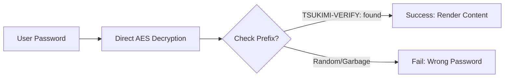

本博客模板基于 [Astro](https://astro.build/) 构建。本指南中未提及的内容，你可以在 [Astro 文档](https://docs.astro.build/) 中找到答案。

## 文章 Front-matter

```yaml
---
title: My First Blog Post
published: 2023-09-09
description: This is the first post of my new Astro blog.
image: ./cover.jpg
tags: [Foo, Bar]
category: Front-end
draft: false
---
```


| 属性           | 说明                                                                                                                                                                                                         |
|---------------|--------------------------------------------------------------------------------------------------------------------------------------------------------------------------------------------------------------|
| `title`       | 文章标题。                                                                                                                                                                                                   |
| `published`   | 文章发布日期。                                                                                                                                                                                               |
| `pinned`      | 是否将文章置顶到文章列表顶部。                                                                                                                                                                               |
| `description` | 文章的简短描述，显示在首页。                                                                                                                                                                                 |
| `image`       | 文章封面图片路径。<br/>1. 以 `http://` 或 `https://` 开头：使用网络图片<br/>2. 以 `/` 开头：使用 `public` 目录中的图片<br/>3. 无前缀：相对于 Markdown 文件的路径                                              |
| `tags`        | 文章标签。                                                                                                                                                                                                   |
| `category`    | 文章分类。                                                                                                                                                                                                   |
| `alias`       | 文章别名。文章可通过 `/posts/{alias}/` 访问。例如：`my-special-article`（可通过 `/posts/my-special-article/` 访问）                                                                                          |
| `licenseName` | 文章内容的许可证名称。                                                                                                                                                                                       |
| `author`      | 文章作者。                                                                                                                                                                                                   |
| `sourceLink`  | 文章内容的来源链接或引用。                                                                                                                                                                                   |
| `draft`       | 文章是否仍为草稿，草稿不会显示。                                                                                                                                                                             |
| `encrypted`   | 文章是否受密码保护。                                                                                                                                                                                         |
| `password`    | 解锁加密文章的密码。                                                                                                                                                                                         |
| `passwordHint`| 帮助用户回忆密码的提示，显示在密码输入框下方。                                                                                                                                                               |
| `hideHomeContent` | 是否隐藏公开的文章摘要，包括首页、meta 标签、Feed/API 摘要和分享预览。设置 `password` 时默认为 `true`。                                                                                                      |

## 文章文件放置位置


文章文件应放置在 `src/content/posts/` 目录下。你也可以创建子目录来更好地组织文章和资源。

::: file-tree

- src/content/posts/
  - post-1.md
  - post-2/
    - cover.png
    - index.md

:::

## 文章别名

你可以通过在 front-matter 中添加 `alias` 字段来为文章设置别名：

```yaml
---
title: My Special Article
published: 2024-01-15
alias: "my-special-article"
tags: ["Example"]
category: "Technology"
---
```

设置别名后：
- 文章可通过自定义 URL 访问（例如 `/posts/my-special-article/`）
- 默认的 `/posts/{slug}/` URL 仍然可用
- RSS/Atom 订阅将使用自定义别名
- 所有内部链接将自动使用自定义别名

**注意事项：**
- 别名不应包含 `/posts/` 前缀（会自动添加）
- 避免在别名中使用特殊字符和空格
- 使用小写字母和连字符以获得最佳 SEO 效果
- 确保别名在所有文章中唯一
- 不要包含前导或尾随斜杠


## 工作原理



## 页面加密

你可以通过在 front-matter 中设置 `encrypted: true` 并提供 `password` 来为文章添加密码保护：

```yaml
---
title: My Private Post
published: 2024-01-15
encrypted: true
password: "my-secret-password"
passwordHint: "Hint: The password is my dog's name"
hideHomeContent: true
---
```

### 字段

| 字段              | 必填 | 说明                                                                                   |
|-------------------|------|----------------------------------------------------------------------------------------|
| `encrypted`       | 是   | 设为 `true` 以启用密码保护                                                             |
| `password`        | 是   | 解锁文章的密码                                                                         |
| `passwordHint`    | 否   | 显示在密码输入框下方的提示，帮助用户回忆密码                                           |
| `hideHomeContent` | 否   | 隐藏公开摘要，显示为 `该文章已加密`。设置 `password` 时默认为 `true`。设为 `false` 可显示正常摘要。 |

### 解锁框外观

解锁框会显示：
- 主题主色调的锁图标
- 文章标题"密码保护"
- 请求输入密码的说明文字
- 提示信息（如果提供了 `passwordHint`）
- 密码输入框和解锁按钮

输入正确密码后，内容将被解密并显示。密码会存储在 session storage 中，因此用户在同一会话中的后续页面加载时无需重新输入。