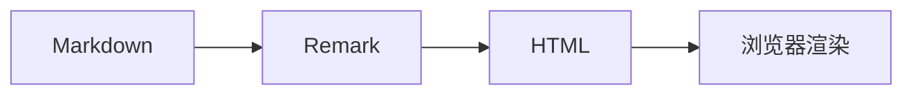
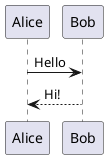

本文档展示 Tsukimi 支持的所有 Markdown 扩展指令。在普通 `.md` 文件中直接使用 `:::` 和 `:` 语法，无需 import，无需 MDX。

---

## GitHub 仓库卡片(::github)

通过 GitHub API 自动拉取仓库信息，生成动态卡片。

效果：

::github{repo="souloss/Tsukimi"}

源码：

`````markdown
::github{repo="用户名/仓库名"}
`````

参数：

| 参数 | 说明 | 必填 | 默认值 |
|------|------|------|--------|
| `repo` | GitHub 仓库路径，格式 `用户名/仓库名` | ✅ | — |

---

## 提示框(:::callout/:::note 等)

支持通用 `:::callout` 和 13 种预设类型，也兼容 GitHub 的 `[!TYPE]` 提示框语法。

效果：

:::note
即使快速浏览也应注意的信息。
:::

:::tip
帮助用户更高效完成操作的可选信息。
:::

:::important
用户成功完成操作必需的关键信息。
:::

:::warning
存在潜在风险，需立即关注的重要内容。
:::

:::caution
某操作可能导致的负面后果。
:::

通用写法可以通过 `type`、`title` 和 `color` 自定义：

:::callout{type="question" title="为什么要使用指令？"}
通用容器适合表达预设类型之外的提示。
:::

:::note{title="自定义颜色" color="#0ea5e9"}
`note` 类型可覆盖默认主题色。
:::

源码：

`````markdown
:::note
即使快速浏览也应注意的信息。
:::

:::tip
帮助用户更高效完成操作的可选信息。
:::

:::important
用户成功完成操作必需的关键信息。
:::

:::warning
存在潜在风险，需立即关注的重要内容。
:::

:::caution
某操作可能导致的负面后果。
:::

:::callout{type="question" title="为什么要使用指令？"}
通用容器适合表达预设类型之外的提示。
:::

:::note{title="自定义颜色" color="#0ea5e9"}
`note` 类型可覆盖默认主题色。
:::
`````

类型说明：

| 类型 | 用途 |
|------|------|
| `note` | 需要注意的信息 |
| `info` | 一般信息 |
| `tip` | 有用的可选建议 |
| `important` | 成功必需的关键信息 |
| `warning` | 潜在风险警告 |
| `caution` | 可能导致负面后果的警告 |
| `question` | 问题或思考 |
| `quote` | 引用内容 |
| `bug` | 已知问题 |
| `example` | 示例内容 |
| `success` | 成功状态 |
| `failure` | 失败状态 |
| `danger` | 高风险警告 |

`:::callout{type="warn"}` 也可作为 `warning` 的别名。`title` 设置标题；`note` 类型可用 `color` 覆盖主题色。GitHub 风格语法会自动转换为对应的提示框：

`````markdown
> [!NOTE]
> 这段内容会被转换为 `:::note`。
`````

---

## 代码分组(:::code-group)

专用于代码块的选项卡容器，标签自动从代码块语言或 `[标签名]` 派生。

效果：

:::code-group
```js [npm]
npm install
```

```js [yarn]
yarn add
```

```js [pnpm]
pnpm add
```
:::

源码：

`````markdown
:::code-group
```js [npm]
npm install
```

```js [yarn]
yarn add
```

```js [pnpm]
pnpm add
```
:::
`````

参数：

| 参数 | 说明 | 默认值 |
|------|------|--------|
| `[标签名]` | 代码块元信息中指定标签名，如 `[pnpm]` | — |
| `:active` | 在代码块元信息中设置默认激活项 | 第一个代码块 |

---

## 字段文档(:::field/:::field-group)

用于 API 或配置项的结构化文档展示。支持 `@type`、`@required`、`@optional`、`@deprecated`、`@default`、`@description` 标签。

### 单个字段

使用 `:::field{名称}` 展示单个字段的类型、约束和描述。

:::field{name}

@type string

@required

@description 资源的唯一标识符

:::

### 字段组

使用 `::::field-group` 将多个字段排列在一起，自动添加分隔线。

::::field-group
:::field{port}

@type number

@default 3000

@description 监听的端口号

:::

:::field{host}

@type string

@default "localhost"

@deprecated

@description 绑定的主机名（请使用 `address` 替代）

:::

:::field{debug}

@type boolean

@optional

@description 启用调试日志

:::
::::

源码：

`````markdown
:::field{name}

@type string

@required

@description 资源的唯一标识符

:::

::::field-group
:::field{port}

@type number

@default 3000

@description 监听的端口号

:::

:::field{host}

@type string

@default "localhost"

@deprecated

@description 绑定的主机名（请使用 `address` 替代）

:::
::::
`````

标签说明：

| 标签 | 说明 |
|------|------|
| `@type` | 字段类型 |
| `@required` | 标记为必填（绿色标签） |
| `@optional` | 标记为可选（灰色标签） |
| `@deprecated` | 标记为已废弃（红色标签，字段名加删除线） |
| `@default` | 默认值 |
| `@description` | 字段描述 |

指令说明：

| 指令 | 说明 |
|------|------|
| `:::field{名称}` | 单个字段 |
| `::::field-group` | 字段组容器，字段间自动添加分隔线 |

---

## 代码树(:::code-tree)

左侧文件树 + 右侧代码面板的组合视图。点击文件名切换代码，点击文件夹展开/收起。

效果：

:::code-tree{title="My Project" entry="src/main.ts"}
```ts title="src/main.ts" :active
import { app } from './app'

app.listen(3000, () => {
  console.log('Server running on port 3000')
})
```

```ts title="src/app.ts"
import express from 'express'

export const app = express()

app.get('/', (req, res) => {
  res.json({ hello: 'world' })
})
```
:::

源码：

`````markdown
:::code-tree{title="My Project" entry="src/main.ts"}
```ts title="src/main.ts" :active
import { app } from './app'

app.listen(3000, () => {
  console.log('Server running on port 3000')
})
```

```ts title="src/app.ts"
import express from 'express'

export const app = express()

app.get('/', (req, res) => {
  res.json({ hello: 'world' })
})
```
:::
`````

参数：

| 参数 | 说明 | 必填 | 默认值 |
|------|------|------|--------|
| `title` | 代码树标题 | ❌ | — |
| `entry` | 默认激活的文件路径 | ❌ | — |
| `height` | 代码树容器高度 | ❌ | — |
| `dir` | 导入目录路径，自动扫描文件构建代码树 | ❌ | — |
| `:active` | 代码块元信息，标记默认激活文件 | ❌ | — |

代码块的 `title` 属性用于构建文件树路径，以 `/` 分隔会自动创建文件夹层级。

### 从目录导入

使用 `dir` 属性可以导入整个目录作为代码树，自动扫描目录下所有文件：

:::code-tree{dir="public/demos/sample-web-project" title="示例 Web 项目" entry="src/main.ts"}
:::

---

## 折叠块(:::details/:::folders)

### 基础折叠

使用 `:::details` 创建可展开/收起的内容区域。

效果：

:::details{title="点击展开" open="true"}
这个内容默认展开。`folding`、`collapse`、`details` 三个指令名称效果完全相同。
:::

源码：

`````markdown
:::details{title="点击展开" open="true"}
这个内容默认展开。`folding`、`collapse`、`details` 三个指令名称效果完全相同。
:::
`````

参数：

| 参数 | 说明 | 必填 | 默认值 |
|------|------|------|--------|
| `title` | 折叠块标题 | ✅ | `"Details"` |
| `open="true"` | 默认展开 | ❌ | — |
| `color` | 主题色 | ❌ | `accent` |

### 多级折叠

使用 `:::folders` 创建多个独立折叠面板，面板间自动添加分隔线。

效果：

:::folders
folder: 第一章：基础概念

Astro 是一个**内容优先**的静态站点生成器。核心特点：

1. 零 JS 默认输出
2. 群岛架构
3. 支持 React / Vue / Svelte

folder: 第二章：组件系统

Astro 组件使用 `.astro` 后缀，语法类似 HTML + JS：

```astro
---
const name = 'Astro';
---
<h1>Hello {name}</h1>
```

folder: 第三章：内容集合

使用 [Content Collections](https://docs.astro.build/zh-cn/guides/content-collections/) 管理类型安全的内容。
:::

源码：

`````markdown
:::folders
folder: 第一章：基础概念

Astro 是一个**内容优先**的静态站点生成器。核心特点：

1. 零 JS 默认输出
2. 群岛架构
3. 支持 React / Vue / Svelte

folder: 第二章：组件系统

Astro 组件使用 `.astro` 后缀，语法类似 HTML + JS：

```astro
---
const name = 'Astro';
---
<h1>Hello {name}</h1>
```

folder: 第三章：内容集合

使用 [Content Collections](https://docs.astro.build/zh-cn/guides/content-collections/) 管理类型安全的内容。
:::
`````

### 手风琴模式

添加 `accordion` 属性，同一时间只能展开一个面板。

效果：

:::folders{accordion}
folder: 安装

运行 `npm install` 安装依赖。

folder: 配置

编辑 `config.json` 设置偏好。

folder: 部署

运行 `npm run build && npm run deploy`。
:::

源码：

`````markdown
:::folders{accordion}
folder: 安装

运行 `npm install` 安装依赖。

folder: 配置

编辑 `config.json` 设置偏好。

folder: 部署

运行 `npm run build && npm run deploy`。
:::
`````

指令说明：

| 指令 | 说明 |
|------|------|
| `:::details{title="标题"}` | 单个折叠块 |
| `:::folders` | 多个折叠面板 |
| `:::folders{accordion}` | 手风琴模式，同时只展开一个 |
| `folder: 标题` | 面板标题行，后跟内容 |

---

## 卡片网格(::::card-grid)

使用 `::::card-grid` 将多个 `:::card` 以响应式网格布局排列。

效果：

::::card-grid
:::card{title="快速" icon="lucide:zap" color="#22c55e"}
基于 Astro 6 静态输出，页面加载极快。
:::

:::card{title="现代" icon="lucide:code" color="#3b82f6"}
Svelte 5 runes 模式、Tailwind CSS 4、TypeScript。
:::

:::card{title="丰富" icon="lucide:bookmark" color="#a855f7"}
扩展 Markdown 指令 80+，图表、交互组件一应俱全。
:::
::::

源码：

`````markdown
::::card-grid
:::card{title="快速" icon="lucide:zap" color="#22c55e"}
基于 Astro 6 静态输出，页面加载极快。
:::

:::card{title="现代" icon="lucide:code" color="#3b82f6"}
Svelte 5 runes 模式、Tailwind CSS 4、TypeScript。
:::

:::card{title="丰富" icon="lucide:bookmark" color="#a855f7"}
扩展 Markdown 指令 80+，图表、交互组件一应俱全。
:::
::::
`````

指令说明：

| 指令 | 说明 |
|------|------|
| `::::card-grid` | 卡片网格容器 |
| `:::card{title="..."}` | 单个卡片 |

参数：

| 参数 | 说明 | 必填 | 默认值 |
|------|------|------|--------|
| `title` | 卡片标题 | ❌ | — |
| `icon` | 卡片图标，支持 `lucide:名称` 格式 | ❌ | — |
| `color` | 图标和主题色 | ❌ | `accent` |
| `href` | 点击跳转链接 | ❌ | — |

---

## 代码块标注(del/ins/聚焦)

Expressive Code 内置支持行标注，通过代码块元信息指定行号。支持三种标注类型：

- **删除行** `del={行号}` — 红色高亮，表示被删除的代码
- **新增行** `ins={行号}` — 绿色高亮，表示新增的代码
- **聚焦行** `{行号}` — 蓝色高亮，表示需要关注的行

支持行号范围，如 `del={2}`、`ins={3-4}`、`{5-7}`。

### 行标注示例

```typescript del={2} ins={3} {5}
function getUser(id: string) {
  const user = db.findUser(id)
  const user = db.findById(id)
  if (!user) {
    throw new Error('Not found')
  }
  return user
}
```

源码：

`````markdown
```typescript del={2} ins={3} {5}
function getUser(id: string) {
  const user = db.findUser(id)
  const user = db.findById(id)
  if (!user) {
    throw new Error('Not found')
  }
  return user
}
```
`````

### diff 语法

使用 `diff` 语言标识符，通过 `+`/`-` 前缀标注行，同时保留语法高亮：

```diff lang="ts"
- const user = db.findUser(id)
+ const user = db.findById(id)
  if (!user) {
    throw new Error('Not found')
  }
```

源码：

`````markdown
```diff lang="ts"
- const user = db.findUser(id)
+ const user = db.findById(id)
  if (!user) {
    throw new Error('Not found')
  }
```
`````

### 参数说明

| 标注 | 语法 | 说明 | 颜色 |
|------|------|------|------|
| 删除行 | `del={行号}` | 标记为删除的代码行 | 🔴 红色 |
| 新增行 | `ins={行号}` | 标记为新增的代码行 | 🟢 绿色 |
| 聚焦行 | `{行号}` | 需要关注的代码行 | 🔵 蓝色 |
| diff 语法 | `diff lang="语言"` | 使用 `+`/`-` 前缀标注 | 同上 |

行号支持范围写法：`del={2-5}` 表示第 2-5 行，多个范围用空格分隔：`ins={3-4} ins={8-10}`。

代码行末还支持 Expressive Code 标记：`// [!code ++]`（新增）、`// [!code --]`（删除）、`// [!code focus]`（聚焦）、`// [!code error]`（错误）和 `// [!code warning]`（警告）。

`````markdown
```ts
const oldValue = getValue() // [!code --]
const newValue = getValueV2() // [!code ++]
throw new Error("failed") // [!code error]
```
`````

---

## 代码块折叠

代码块支持两种折叠方式：**自动折叠**（超过行数阈值自动添加折叠按钮）和**强制折叠**（通过 `collapse` 标记手动指定）。

### 自动折叠

当代码块行数超过配置的阈值（默认 10 行）时，自动添加折叠按钮。折叠后显示前 5 行预览，底部渐变遮罩提示可展开。

```typescript
interface UserProfile {
  id: string
  name: string
  email: string
  avatar: string
  bio: string
  createdAt: Date
  updatedAt: Date
  settings: {
    theme: 'light' | 'dark' | 'system'
    language: string
    notifications: boolean
  }
}

function formatUserProfile(user: UserProfile): string {
  const { name, email, bio } = user
  return `${name} <${email}> — ${bio}`
}
```

### 强制折叠

在代码块语言标识后添加 `collapse`，强制代码块默认折叠，无论行数多少：

```go collapse
package main

import "fmt"

func main() {
    fmt.Println("Hello, World!")
}
```

源码：

`````markdown
```go collapse
package main

import "fmt"

func main() {
    fmt.Println("Hello, World!")
}
```
`````

### 配置项

| 配置 | 说明 | 默认值 |
|------|------|--------|
| `enable` | 是否启用代码块折叠功能 | `true` |
| `lineThreshold` | 触发自动折叠的行数阈值 | `10` |
| `previewLines` | 折叠时显示的预览行数 | `5` |
| `defaultCollapsed` | 超过阈值时是否默认折叠 | `false` |

配置位于 `src/config/expressiveCodeConfig.ts` 的 `pluginCollapsible` 字段。

---

## 视频播放器(:::video)

支持本地视频、Bilibili 和 YouTube 三种视频源。

### 本地视频（带封面）

通过 `src` 属性指定视频地址，`poster` 设置封面图。

:::video{src="https://interactive-examples.mdn.mozilla.net/media/cc0-videos/flower.mp4" poster="https://images.unsplash.com/photo-1490750967868-88aa4f44baee?w=800&q=80" ratio="16/9"}
:::

### Bilibili 视频

通过 `bilibili` 属性指定 BV 号即可嵌入。

:::video{bilibili=BV1uT4y1P7CX ratio="16/9"}
:::

### YouTube 视频

通过 `youtube` 属性指定视频 ID 即可嵌入。

:::video{youtube=dQw4w9WgXcQ ratio="16/9"}
:::

源码：

`````markdown
<!-- 本地视频（带封面） -->
:::video{src="https://interactive-examples.mdn.mozilla.net/media/cc0-videos/flower.mp4" poster="https://images.unsplash.com/photo-1490750967868-88aa4f44baee?w=800&q=80" ratio="16/9"}
:::

<!-- Bilibili -->
:::video{bilibili=BV1uT4y1P7CX ratio="16/9"}
:::

<!-- YouTube -->
:::video{youtube=dQw4w9WgXcQ ratio="16/9"}
:::
`````

参数：

| 参数 | 说明 | 必填 | 默认值 |
|------|------|------|--------|
| `src` | 本地视频 URL | 三选一 | — |
| `bilibili` | Bilibili BV 号（可省略 `BV` 前缀） | 三选一 | — |
| `youtube` | YouTube 视频 ID | 三选一 | — |
| `poster` | 封面图片 URL（仅 `src` 模式） | ❌ | — |
| `ratio` | 宽高比 | ❌ | `16/9` |
| `width` | 视频宽度 | ❌ | — |
| `align` | 视频对齐位置，可使用 CSS 对齐值 | ❌ | — |
| `autoplay` | 自动播放（需同时静音） | ❌ | — |
| `pip` | 画中画模式 | ❌ | `auto` |

---

## 选项卡(:::tabs)

使用 `:::tabs` 创建选项卡内容，支持跨组同步切换。

### 基础选项卡

使用 `[标签名]` 或 `tab: 标签名` 语法定义每个选项卡。`tab:` 语法还支持为标签设置颜色。

:::tabs
[pnpm] pnpm add astro

[yarn] yarn add astro

[npm] npm install astro
:::

:::tabs{align="right"}
tab: 稳定版{color="#22c55e"}

推荐用于生产环境。

tab: 实验版{color="#f97316"}

用于体验最新功能。
:::

### 同步选项卡

多个选项卡组可通过 `sync` 属性联动切换：

:::tabs{sync="pkg"}
[pnpm] `pnpm add @astrojs/svelte`

[yarn] `yarn add @astrojs/svelte`

[npm] `npm install @astrojs/svelte`
:::

:::tabs{sync="pkg"}
[pnpm] `pnpm add svelte`

[yarn] `yarn add svelte`

[npm] `npm install svelte`
:::

:::tabs{align="center"}
tab: pnpm

`pnpm add astro`

tab: npm

`npm install astro`
:::

源码：

`````markdown
<!-- 基础选项卡 -->
:::tabs
[pnpm] pnpm add astro

[yarn] yarn add astro

[npm] npm install astro
:::

<!-- 同步选项卡 -->
:::tabs{sync="pkg"}
[pnpm] `pnpm add @astrojs/svelte`

[yarn] `yarn add @astrojs/svelte`

[npm] `npm install @astrojs/svelte`
:::

<!-- 对齐与 tab: 语法 -->
:::tabs{align="center"}
tab: pnpm{color="#3b82f6"}

`pnpm add astro`

tab: npm

`npm install astro`
:::
`````

参数：

| 参数 | 说明 | 必填 | 默认值 |
|------|------|------|--------|
| `[标签名]` / `tab: 标签名` | 选项卡标签文本 | ✅ | — |
| `sync` | 同步组名，相同组名的选项卡联动切换 | ❌ | — |
| `align` | 标签栏对齐方式 | ❌ | — |
| `color` | `tab:` 标签的激活色 | ❌ | — |

---

## 时间线(:::timeline)

使用 `:::timeline` 创建时间轴视图，展示事件序列。

效果：

:::timeline
- 2024-01 项目启动，完成基础架构
- 2024-03 首个公开版本发布
- 2024-06 支持自定义主题和国际化
- 2024-09 新增音乐播放器和 Live2D 看板娘
- 2025-01 迁移至 Astro 6 + Svelte 5
:::

源码：

`````markdown
:::timeline
- 2024-01 项目启动，完成基础架构
- 2024-03 首个公开版本发布
- 2024-06 支持自定义主题和国际化
- 2024-09 新增音乐播放器和 Live2D 看板娘
- 2025-01 迁移至 Astro 6 + Svelte 5
:::
`````

格式说明：

| 格式 | 说明 |
|------|------|
| `- 日期 描述` | 时间线条目，日期与标题以空格分隔 |
| `- 日期 \| 标题 \| 描述` | 使用竖线分别指定日期、标题和描述 |

---

## 步骤(:::steps)

使用 `:::steps` 创建带编号的步骤指引。

效果：

:::steps
1. 安装依赖

   运行 `pnpm install` 安装项目依赖。

2. 配置环境

   复制 `.env.example` 为 `.env` 并填写配置。

3. 启动开发服务器

   ```bash
   pnpm dev
   ```

4. 构建生产版本

   ```bash
   pnpm build
   ```
:::

源码：

`````markdown
:::steps
1. 安装依赖

   运行 `pnpm install` 安装项目依赖。

2. 配置环境

   复制 `.env.example` 为 `.env` 并填写配置。

3. 启动开发服务器

   ```bash
   pnpm dev
   ```

4. 构建生产版本

   ```bash
   pnpm build
   ```
:::
`````

---

## 诗歌(:::poetry)

使用 `:::poetry` 排版诗歌或歌词，自动保留换行和缩进。

效果：

:::poetry{title="水调歌头" author="苏轼"}
明月几时有？把酒问青天。
不知天上宫阙，今夕是何年。
我欲乘风归去，又恐琼楼玉宇，高处不胜寒。
起舞弄清影，何似在人间。
:::

源码：

`````markdown
:::poetry{title="水调歌头" author="苏轼"}
明月几时有？把酒问青天。
不知天上宫阙，今夕是何年。
我欲乘风归去，又恐琼楼玉宇，高处不胜寒。
起舞弄清影，何似在人间。
:::
`````

参数：

| 参数 | 说明 | 必填 | 默认值 |
|------|------|------|--------|
| `title` | 诗歌标题 | ❌ | — |
| `author` | 作者 | ❌ | — |
| `date` | 日期或创作时间 | ❌ | — |
| `footer` | 底部落款或补充信息 | ❌ | — |

---

## 胶卷(:::reel)

使用 `:::reel` 创建水平滚动的卡片容器。

效果：

::::reel
:::card{title="Astro" icon="lucide:rocket" color="#ff5d01"}
内容优先的 Web 框架。
:::

:::card{title="Svelte" icon="lucide:component" color="#ff3e00"}
编译型前端框架，无虚拟 DOM。
:::

:::card{title="Tailwind" icon="lucide:paintbrush" color="#06b6d4"}
原子化 CSS 框架。
:::

:::card{title="TypeScript" icon="lucide:file-code" color="#3178c6"}
类型安全的 JavaScript 超集。
:::
::::

源码：

``````markdown
::::reel
:::card{title="Astro" icon="lucide:rocket" color="#ff5d01"}
内容优先的 Web 框架。
:::

:::card{title="Svelte" icon="lucide:component" color="#ff3e00"}
编译型前端框架，无虚拟 DOM。
:::

:::card{title="Tailwind" icon="lucide:paintbrush" color="#06b6d4"}
原子化 CSS 框架。
:::

:::card{title="TypeScript" icon="lucide:file-code" color="#3178c6"}
类型安全的 JavaScript 超集。
:::
::::
``````

可选属性 `title`、`author`、`date` 和 `footer` 分别设置标题、作者、日期和底部说明。

---

## 纸张(:::paper)

使用 `:::paper` 创建纸张风格的容器，适合展示信件或文档。

效果：

:::paper
致未来的自己：

当你看到这段文字时，希望一切安好。技术日新月异，但创造的初心不变。

—— 来自 2024 年的开发者
:::

源码：

`````markdown
:::paper
致未来的自己：

当你看到这段文字时，希望一切安好。技术日新月异，但创造的初心不变。

—— 来自 2024 年的开发者
:::
`````

可选属性：`style` 设置纸张样式，`title`、`author`、`date` 和 `footer` 设置页眉页脚信息。纸张内部还可使用 `<!-- section: 标题 -->`、`<!-- line: left|right -->` 注释划分内容。

---

## 引用(:::blockquote/:::quot)

`:::blockquote` 创建带装饰引号的引用块；`:::quot` 创建带图标的紧凑引用卡片。

### 装饰引用

:::blockquote
设计应服务于内容，而不是遮挡内容。
:::

### 紧凑引用

:::quot{icon="lucide:quote"}
Talk is cheap. Show me the code.
:::

源码：

`````markdown
:::blockquote
设计应服务于内容，而不是遮挡内容。
:::

:::quot{icon="lucide:quote"}
Talk is cheap. Show me the code.
:::
`````

`:::quot` 的 `icon` 可填写 `lucide:名称`、`fa7-solid:名称`、图标名称或图片 URL；省略时使用默认引号图标。引用作者和来源不会由该指令单独渲染，需写入正文。

---

## 网格(:::grid)

使用 `:::grid` 创建响应式网格布局。

效果：

::::grid{cols="2"}
:::card{title="左侧" icon="lucide:arrow-left"}
网格的第一列内容。
:::

:::card{title="右侧" icon="lucide:arrow-right"}
网格的第二列内容。
:::
::::

源码：

``````markdown
::::grid{cols="2"}
:::card{title="左侧" icon="lucide:arrow-left"}
网格的第一列内容。
:::

:::card{title="右侧" icon="lucide:arrow-right"}
网格的第二列内容。
:::
::::
``````
参数：

| 参数 | 说明 | 必填 | 默认值 |
|------|------|------|--------|
| `cols` | 列数 | ❌ | `2` |
| `gap` | 间距 | ❌ | `16`（px） |
| `minw` | 最小列宽（自动列数时） | ❌ | `240px` |
| `bg` | 背景样式 | ❌ | `card` |

---

## 对齐容器(:::left/:::center/:::right/:::justify)

使用四种对齐容器调整其中内容的文本对齐方式。

:::center
这段内容居中显示。
:::

源码：

`````markdown
:::left
左对齐内容。
:::

:::center
居中内容。
:::

:::right
右对齐内容。
:::

:::justify
两端对齐内容。
:::
`````

---

## 弹性布局(:::flex)

使用 `:::flex` 创建弹性容器，支持方向、对齐等参数。

效果：

::::flex{justify="center" align="center" gap="2rem"}
:::card{title="A" icon="lucide:box"}
项目 A
:::

:::card{title="B" icon="lucide:box"}
项目 B
:::

:::card{title="C" icon="lucide:box"}
项目 C
:::
::::

源码：

``````markdown
::::flex{justify="center" align="center" gap="2rem"}
:::card{title="A" icon="lucide:box"}
项目 A
:::

:::card{title="B" icon="lucide:box"}
项目 B
:::

:::card{title="C" icon="lucide:box"}
项目 C
:::
::::
``````
参数：

| 参数 | 说明 | 可选值 | 默认值 |
|------|------|------|--------|
| `column` | 纵向排列 | `true` | `false` |
| `justify` / `main` | 主轴对齐 | `start` / `center` / `end` / `between` / `around` / `evenly` | — |
| `align` / `cross` | 交叉轴对齐 | `start` / `center` / `end` / `stretch` | — |
| `gap` | 间距 | CSS 值，如 `1rem` | `1rem` |

---

## 复制(:::copy)

使用 `:::copy` 创建可复制的内容区域。

效果：

:::copy{title="安装命令"}
```bash
pnpm add @astrojs/svelte
```
:::

源码：

`````markdown
:::copy{title="安装命令"}
```bash
pnpm add @astrojs/svelte
```
:::
`````
参数：

| 参数 | 说明 | 必填 | 默认值 |
|------|------|------|--------|
| `label` / `title` | 复制区标题 | ❌ | — |

---

## 画廊(:::gallery)

使用 `:::gallery` 创建图片画廊，点击可查看大图。

效果：

:::gallery


:::

源码：

`````markdown
:::gallery


:::
`````

参数：

| 参数 | 说明 | 默认值 |
|------|------|--------|
| `cols` | 画廊列数 | `3` |
| `gap` | 图片间距（px） | `8` |

---

## 图片指令(::image)

使用 `::image` 直接生成图片元素，可显式指定替代文本、尺寸和加载策略。

效果：

::image{src="/images/albums/AcgExample/cover.webp" alt="示例图片" width="480" height="270"}

源码：

`````markdown
::image{src="/images/albums/AcgExample/cover.webp" alt="示例图片" width="480" height="270"}
`````

`src` 和 `alt` 是常用属性，`width`、`height` 可传递给 ``；图片默认使用原生懒加载。

---

## 终端录制(:::asciinema)

使用 `:::asciinema` 嵌入终端录制回放。

效果：

:::asciinema{src="/demos/demo.cast"}
:::

源码：

`````markdown
:::asciinema{src="/demos/demo.cast"}
:::
`````
参数：

| 参数 | 说明 | 必填 | 默认值 |
|------|------|------|--------|
| `src` | asciinema 录制文件 URL（`.cast` 格式） | ✅ | — |
| `cols` | 终端列数 | ❌ | `80` |
| `rows` | 终端行数 | ❌ | `24` |

---

## 色板(:::colors)

使用 `:::colors` 展示调色板或颜色列表。

效果：

:::colors{values="#3b82f6,#22c55e,#ef4444,#f59e0b,#8b5cf6"}
:::

源码：

`````markdown
:::colors{values="#3b82f6,#22c55e,#ef4444,#f59e0b,#8b5cf6"}
:::
`````
参数：

| 参数 | 说明 | 必填 | 默认值 |
|------|------|------|--------|
| `values` | 颜色值列表，逗号分隔 | ✅ | — |

---

## 对话(:::chat)

使用 `:::chat` 创建对话气泡视图，支持标题、日期分隔符和多种发送者标识。

效果：

:::chat{title="Tsukimi 功能咨询"}
{:2025-06-17 14:30}

{.} 你好！Tsukimi 支持哪些功能？

{对方} 它支持 Markdown 扩展指令、音乐播放器、Live2D 看板娘等丰富功能。

{.} 太棒了，怎么开始使用？

{对方} 查看文档即可快速上手！
:::

源码：

`````markdown
:::chat{title="Tsukimi 功能咨询"}
{:2025-06-17 14:30}

{.} 你好！Tsukimi 支持哪些功能？

{对方} 它支持 Markdown 扩展指令、音乐播放器、Live2D 看板娘等丰富功能。

{.} 太棒了，怎么开始使用？

{对方} 查看文档即可快速上手！
:::
`````
标识说明：

| 标识 | 说明 |
|------|------|
| `{.}` 或 `[自己]` | 右侧气泡，主色调 |
| `{用户名}` 或 `[用户名]` | 左侧气泡，显示用户名 |
| `{:日期时间}` | 居中日期分隔线 |
| `title="标题"` | 对话框标题 |

---

## npm 包(:::npm-to)

使用 `:::npm-to` 展示 npm 包信息和安装命令。

效果：

:::npm-to{package="astro"}
:::

源码：

`````markdown
:::npm-to{package="包名"}
:::
`````
参数：

| 参数 | 说明 | 必填 | 默认值 |
|------|------|------|--------|
| `package` | npm 包名 | ✅ | — |
| `tabs` | 显示的包管理器 | ❌ | `npm,pnpm,yarn,bun` |

---

## 卡片(:::card)

使用 `:::card` 创建独立卡片，可添加标题、图标和链接。

效果：

:::card{title="Tsukimi" icon="lucide:moon" color="#a855f7" href="https://github.com/souloss/Tsukimi"}
一个功能丰富的 Astro 博客模板，支持丰富的 Markdown 扩展指令。
:::

源码：

`````markdown
:::card{title="Tsukimi" icon="lucide:moon" color="#a855f7" href="https://github.com/souloss/Tsukimi"}
一个功能丰富的 Astro 博客模板，支持丰富的 Markdown 扩展指令。
:::
`````
参数：

| 参数 | 说明 | 必填 | 默认值 |
|------|------|------|--------|
| `title` | 卡片标题 | ❌ | — |
| `icon` | 图标，支持 `lucide:名称` | ❌ | — |
| `color` | 图标和主题色 | ❌ | `accent` |
| `href` | 点击跳转链接 | ❌ | — |
| `image` / `cover` | 链接卡片的预览图片 | ❌ | — |
| `desc` / `description` | 链接卡片的描述文字 | ❌ | — |

---

## 链接卡片样式(:::card with image)

使用 `:::card` 指定 `image` 和 `href` 属性即可生成链接预览样式的卡片。

效果：

:::card{href="https://astro.build" title="Astro 官网" image="https://astro.build/assets/press/astro-icon-light.png" desc="内容优先的现代 Web 框架。"}
:::

源码：

`````markdown
:::card{href="https://astro.build" title="Astro 官网" image="https://astro.build/assets/press/astro-icon-light.png" desc="内容优先的现代 Web 框架。"}
:::
`````


参数：

| 参数 | 说明 | 必填 | 默认值 |
|------|------|------|--------|
| `href` | 链接地址 | ✅ | — |
| `title` | 卡片标题 | ❌ | — |
| `image` / `cover` | 预览图片 | ❌ | — |
| `desc` / `description` | 描述文字 | ❌ | — |

---

## 内联指令(:指令[内容]{参数})

以下指令使用行内语法 `:指令[内容]{参数}` 在段落中直接使用。

### 文本标记(:mark)

使用 `:mark[文本]` 高亮文本，类似荧光笔效果。

这段文字中有:mark[高亮标记]和普通文本。

也可以使用标准扩展语法 `==文本==` 快速高亮：==重点内容==。

源码：

`````markdown
这段文字中有:mark[高亮标记]和普通文本。
也可以使用标准扩展语法 `==文本==` 快速高亮：==重点内容==。
`````

参数：

| 参数 | 说明 | 必填 | 默认值 |
|------|------|------|--------|
| `color` | 高亮颜色，支持 CSS 颜色名 / hex | ❌ | `yellow` |

### 键盘按键(:kbd)

使用 `:kbd[按键]` 显示键盘按键样式。

按下 :kbd[Ctrl] + :kbd[C] 复制，:kbd[Ctrl] + :kbd[V] 粘贴。

源码：

`````markdown
按下 :kbd[Ctrl] + :kbd[C] 复制，:kbd[Ctrl] + :kbd[V] 粘贴。
`````

### 下划线(:u)

使用 `:u[文本]` 添加下划线。

这是:u[带下划线的文本]。

源码：

`````markdown
这是:u[带下划线的文本]。
`````

`color` 可设置下划线颜色，默认使用主题强调色。

### 着重号(:emp)

使用 `:emp[文本]` 添加着重号（CJK 专用），类似日文傍点。

这是:emp[重点内容]需要关注。

源码：

`````markdown
这是:emp[重点内容]需要关注。
`````

`color` 可设置着重号颜色，默认使用主题强调色。

### 波浪线(:wavy)

使用 `:wavy[文本]` 添加波浪下划线。

这是:wavy[波浪线标注的文本]。

源码：

`````markdown
这是:wavy[波浪线标注的文本]。
`````

`color` 可设置波浪线颜色，默认使用主题强调色。

### 删除线(:del)

使用 `:del[文本]` 添加删除线（比 `~~~~` 更灵活）。

原价 :del[¥99]，现价 ¥49。

源码：

`````markdown
原价 :del[¥99]，现价 ¥49。
`````

### 上标与下标(:sup/:sub)

使用 `:sup[文本]` 和 `:sub[文本]` 添加上标和下标。

E = mc:sup[2]，H:sub[2]O。

源码：

`````markdown
E = mc:sup[2]，H:sub[2]O。
`````

`:sup` 和 `:sub` 都支持 `color` 属性，默认使用主题强调色。

### 彩色文字(:color)

使用 `:color[文本]{color="#hex"}` 设置文字颜色。

这是:color[红色文字]{color="#ef4444"}和:color[蓝色文字]{color="#3b82f6"}。

源码：

`````markdown
这是:color[红色文字]{color="#ef4444"}和:color[蓝色文字]{color="#3b82f6"}。
`````
参数：

| 参数 | 说明 | 必填 | 默认值 |
|------|------|------|--------|
| `color` | 文字颜色，支持 hex / CSS 颜色名 | ✅ | — |

### 密码揭示与模糊遮罩(:psw/:blur)

使用 `:psw[文本]` 创建密码遮罩，使用 `:blur[文本]` 创建模糊遮罩。点击即可揭示。

- 密码遮罩：密码是 :psw[s3cret]，点击显示
- 模糊遮罩：:blur[hidden content]，点击揭示

源码：

`````markdown
- 密码遮罩：密码是 :psw[s3cret]，点击显示
- 模糊遮罩：:blur[hidden content]，点击揭示
`````

### 复选框(:checkbox)

使用 `:checkbox[状态]` 创建行内复选框。

- :checkbox[checked] 已完成任务
- :checkbox[unchecked] 待办事项
- :checkbox[checked] 另一项已完成

源码：

`````markdown
- :checkbox[checked] 已完成任务
- :checkbox[unchecked] 待办事项
- :checkbox[checked] 另一项已完成
`````

也可把文本放在指令内容中，通过 `checked="true"` 指定状态；`color` 设置颜色，`symbol` 设置符号样式，`inline="true"` 使用行内布局。

### 单选框(:radio)

使用 `:radio[状态]` 创建行内单选框。

- :radio[selected] 已选中选项
- :radio[unselected] 未选中选项

源码：

`````markdown
- :radio[selected] 已选中选项
- :radio[unselected] 未选中选项
`````

也可使用 `checked="true"` 指定选中状态；`color` 设置颜色，`inline="true"` 使用行内布局。

### 标签(:hashtag)

使用 `:hashtag[标签名]` 创建标签样式的行内元素。

这篇文章的标签是 :hashtag[TypeScript] :hashtag[Astro] :hashtag[前端]。

源码：

`````markdown
这篇文章的标签是 :hashtag[TypeScript] :hashtag[Astro] :hashtag[前端]。
`````

`href` 可设置点击链接，`color` 可设置标签颜色；未指定颜色时会按预设色板循环。

### 徽章(:badge)

使用 `:badge[文本]{type="类型"}` 创建行内徽章。

状态：:badge[稳定]{type="tip"} :badge[实验性]{type="warning"} :badge[已废弃]{type="danger"}

源码：

`````markdown
状态：:badge[稳定]{type="tip"} :badge[实验性]{type="warning"} :badge[已废弃]{type="danger"}
`````

参数：

| 参数 | 说明 | 必填 | 默认值 |
|------|------|------|--------|
| `type` | 徽章类型，同下表 | ❌ | `blue` |
| `color` | 自定义颜色，覆盖 `type` | ❌ | — |

类型说明：

| type | 说明 | 颜色 |
|------|------|------|
| `tip` | 提示 | 绿色 |
| `info` | 信息 | 蓝色 |
| `warning` | 警告 | 橙色 |
| `danger` | 危险 | 红色 |

### 注释(:anno)

使用 `:anno[文本](提示内容)` 创建带悬浮提示的注释文本。

这个:anno[术语](这里是术语的解释)需要解释。

源码：

`````markdown
这个:anno[术语](这里是术语的解释)需要解释。
`````

### 缩写(:abbr)

使用 `:abbr[缩写](全称)` 创建带悬浮提示的缩写。

使用 :abbr[HTML](HyperText Markup Language) 构建 :abbr[UI](User Interface)。

源码：

`````markdown
使用 :abbr[HTML](HyperText Markup Language) 构建 :abbr[UI](User Interface)。
`````

### 表情符号(:emoji)

使用 `:emoji[名称]` 插入 emoji 表情。

我喜欢 :emoji[heart] 编程 :emoji[rocket]。

源码：

`````markdown
我喜欢 :emoji[heart] 编程 :emoji[rocket]。
`````

参数：

| 参数 | 说明 | 必填 | 默认值 |
|------|------|------|--------|
| `height` | emoji 高度 | ❌ | `1.75em` |
| `source` | emoji 来源，可用 `twemoji`、`qq`、`aru`、`tieba`、`blobcat` 或带 `{name}` 的 URL 模板 | ❌ | `twemoji` |
| `name` | 表情资源名称；省略时使用指令文本 | ❌ | 指令文本 |

### 步骤括号(:step-brackets)

使用 `:step-brackets[数字]` 创建带括号的步骤编号。

:step-brackets[1] 安装 → :step-brackets[2] 配置 → :step-brackets[3] 部署

源码：

`````markdown
:step-brackets[1] 安装 → :step-brackets[2] 配置 → :step-brackets[3] 部署
`````

使用 `title` 属性可在编号右侧显示步骤标题。

---

## 文件树(:::file-tree)

使用 `:::file-tree` 创建带图标的文件树视图，支持文件夹折叠和差异标记。

:::file-tree
- src/
  - components/
    - Header.astro
    - Footer.astro
  - pages/
    - index.astro
  - config.ts
- public/
  - favicon.svg
- package.json
- ++ README.md
- -- CHANGELOG.md
:::

源码：

`````markdown
:::file-tree
- src/
  - components/
    - Header.astro
    - Footer.astro
  - pages/
    - index.astro
  - config.ts
- public/
  - favicon.svg
- package.json
- ++ README.md
- -- CHANGELOG.md
:::
`````
语法说明：

| 语法 | 说明 |
|------|------|
| `- 名称/` | 文件夹，以 `/` 结尾 |
| `- 文件名.扩展名` | 文件 |
| `- ++ 新增文件` | 差异标记：新增 |
| `- -- 删除文件` | 差异标记：删除 |
| `- ...` | 省略号 |
| `- 名称 # 注释` | 行末注释 |

---

## 图表与数学公式

### Mermaid 图表

使用小写 `mermaid` 代码块绘制流程图、时序图等。图表在浏览器端渲染，并随主题切换。



源码：

`````markdown

`````

代码块第一行指定图表类型（例如 `flowchart LR`），后续使用 Mermaid 标准语法描述节点、连线和样式。

### PlantUML 图表

使用 `plantuml` 代码块绘制 UML 图。构建时会根据 `src/config/plantumlConfig.ts` 的服务器和主题配置生成图像，页面端支持主题切换、缩放、拖拽和全屏。



源码：

`````markdown

`````

始终使用 `@startuml` 和 `@enduml` 包住 PlantUML 内容；服务器地址、主题和渲染方式由 `src/config/plantumlConfig.ts` 控制。

### Markmap 思维导图

使用 `markmap` 代码块，以 Markdown 标题层级生成可缩放、可拖拽的思维导图。

```markmap
# Tsukimi
## Markdown
### 指令
### 图表
## 主题
### 亮暗色切换
```

源码：

`````markdown
```markmap
# Tsukimi
## Markdown
### 指令
### 图表
## 主题
### 亮暗色切换
```
`````

使用 `#`、`##`、`###` 等 Markdown 标题表示层级；标题文本会成为思维导图节点。

### WaveDrom 时序图

使用 `wavedrom`（或别名 `wave`）代码块编写 WaveJSON。它在构建时生成内联 SVG，适合时钟、总线和握手信号等硬件时序说明。

```wavedrom
{ signal: [
  { name: "clk",  wave: "p......" },
  { name: "bus",  wave: "x.345x.", data: "head body tail" },
  { name: "ready", wave: "0.1..0." }
] }
```

源码：

`````markdown
```wavedrom
{ signal: [
  { name: "clk",  wave: "p......" },
  { name: "bus",  wave: "x.345x.", data: "head body tail" },
  { name: "ready", wave: "0.1..0." }
] }
```
`````

`signal` 是信号数组；每个信号用 `name` 设置名称、用 `wave` 描述每个时间槽的电平，`data` 为总线波形提供标签。也可以使用别名 `wave` 作为代码块语言。

### Bytefield 协议字段图

使用 `bytefield`（或 `bytefield-svg`）代码块，以 bytefield-svg 的 EDN/Clojure DSL 描述网络协议、文件格式和寄存器布局。图表同样在构建时生成内联 SVG，不依赖浏览器脚本。

```bytefield
(def column-labels (mapv #(number-as-hex % 2) (range 32)))
(def boxes-per-row 32)
(draw-column-headers)
(draw-box "Source port" {:span 16})
(draw-box "Destination port" {:span 16})
(draw-box "Length" {:span 16})
(draw-box "Checksum" {:span 16})
```

源码：

`````markdown
```bytefield
(def column-labels (mapv #(number-as-hex % 2) (range 32)))
(def boxes-per-row 32)
(draw-column-headers)
(draw-box "Source port" {:span 16})
(draw-box "Destination port" {:span 16})
(draw-box "Length" {:span 16})
(draw-box "Checksum" {:span 16})
```
`````

`boxes-per-row` 决定每行的 bit 数，`draw-column-headers` 绘制列标题，`draw-box` 使用 `:span` 指定字段占用的 bit 数。`bytefield-svg` 的其他 EDN/Clojure 绘图函数也可以直接使用。

### Vega-Lite 数据可视化

使用 `vega-lite`（别名 `vegalite`、`vl`）代码块编写 JSON 规范。图表会在接近视口时才加载引擎，支持 SVG 导出、工具提示和响应式宽度；未进入视口的图表不会下载运行时。

```vega-lite
{
  "$schema": "https://vega.github.io/schema/vega-lite/v6.json",
  "description": "Monthly notes",
  "data": { "values": [
    { "month": "Jan", "notes": 12 },
    { "month": "Feb", "notes": 19 },
    { "month": "Mar", "notes": 15 }
  ] },
  "mark": { "type": "bar", "cornerRadiusEnd": 3 },
  "encoding": {
    "x": { "field": "month", "type": "nominal", "title": null },
    "y": { "field": "notes", "type": "quantitative", "title": "Notes" }
  }
}
```

源码：

`````markdown
```vega-lite
{
  "$schema": "https://vega.github.io/schema/vega-lite/v6.json",
  "description": "Monthly notes",
  "data": { "values": [
    { "month": "Jan", "notes": 12 },
    { "month": "Feb", "notes": 19 },
    { "month": "Mar", "notes": 15 }
  ] },
  "mark": { "type": "bar", "cornerRadiusEnd": 3 },
  "encoding": {
    "x": { "field": "month", "type": "nominal", "title": null },
    "y": { "field": "notes", "type": "quantitative", "title": "Notes" }
  }
}
```
`````

`data.values` 可直接嵌入小型数据集，也可以改为 `data.url` 引用 JSON/CSV；`mark` 指定图元类型，`encoding` 将字段映射到坐标轴、颜色或大小。代码块语言也支持 `vegalite` 和 `vl`。

PlantUML、Markmap 和 Vega-Lite 的运行时引擎由统一 loader 按需加载；PlantUML 和 Markmap 仍可在各自配置中关闭，关闭后会退化为普通代码块。WaveDrom 和 Bytefield 是构建期渲染器，不会增加页面运行时脚本。

### BMP 位图指令

`:::bitmap` 适合绘制像素图、协议字段示意和小型图标。`.` 或空格表示透明，其余字符表示像素；`palette` 按字符首次出现的顺序分配颜色。位图在构建时转换为内联 SVG，不加载外部脚本。

:::bitmap{scale="12" palette="#0f172a #38bdf8" title="Tsukimi 像素月亮"}
```text
....##....
...#oo#...
..#oooo#..
.#oooooo#.
#oooooooo#
#oooooooo#
.#oooooo#.
..#oooo#..
....##....
```
:::

源码：

`````markdown
:::bitmap{scale="12" palette="#0f172a #38bdf8" title="Tsukimi 像素月亮"}
```text
....##....
...#oo#...
..#oooo#..
.#oooooo#.
#oooooooo#
#oooooooo#
.#oooooo#.
..#oooo#..
....##....
```
:::
`````

常用参数：`scale`（1–32，默认 8）控制单个像素尺寸；`palette` 使用空格或逗号分隔颜色；`color` 设置未列入调色板字符的回退颜色；`background` 添加背景色；`title` 或 `alt` 提供无障碍文本。

### 数学公式

块级公式使用双美元符号：

$$
E = mc^2
$$

本文章通过 frontmatter 开启了行内公式，因此 `$a^2 + b^2 = c^2$` 会渲染为公式。其他文章默认只处理块级公式；如需开启行内公式，在 frontmatter 中加入：

```yaml
math:
  inline: true
```

公式由 KaTeX 渲染。

---

## Markdown 处理增强

### 文件包含

使用 HTML 注释在构建时插入相对当前 Markdown 文件的内容。Markdown 文件会再次解析，其他文件按原始 HTML 插入：

`````markdown
<!-- @include: ./snippet.md -->
<!-- @include: ./snippet.md{5-10} -->
<!-- @include: ./snippet.md{5-} -->
<!-- @include: ./snippet.md{-10} -->
<!-- @include: ./snippet.md#region -->
`````

花括号表示行号范围，`#region` 表示提取代码区域；找不到文件时会保留错误注释，不会中断构建。

### 图片宽度与懒加载

图片替代文本中加入 `w-百分比` 可设置居中宽度，标题会作为图注：

`````markdown

`````

文章中的普通图片和 `::image` 图片都会自动使用 `loading="lazy"` 与 `lazy-image` 类；`data:` 图片会跳过处理。

### 链接与表格

- `./article.md`、`../article.md#section` 形式的相对 Markdown 链接在生产构建时会解析为文章最终 URL，开发环境保持原样。
- Markdown 表格会包裹在 `.table-wrapper` 中，以便在窄屏横向滚动。
- 外部链接自动添加新窗口打开以及 `nofollow`、`noopener`、`noreferrer` 属性。

### 缩写定义

除了前文的 `:abbr` 指令，也支持先在文末定义缩写，再自动标注正文中的完整单词：

`````markdown
HTML 和 CSS 是 Web 开发的基础。

*[HTML]: Hyper Text Markup Language
*[CSS]: Cascading Style Sheets
`````

### 代码块显示增强

代码块默认启用自动换行，并提供行号、语言徽章和复制按钮；其中 `shellsession` 按项目配置隐藏行号。常见文件名还可直接作为语言标识并自动转换，例如 `astro.config.mjs`、`deploy.yml`、`CNAME` 和 `env`；也可以在代码块元信息中使用 `title="文件名"` 明确设置标题。

### 摘要与阅读统计

在文章中插入 `<!-- more -->` 会将其前的内容作为摘要；未插入时使用第一段文字作为摘要。构建时还会按中日韩字符和英文单词分别计算字数与预计阅读分钟数。
